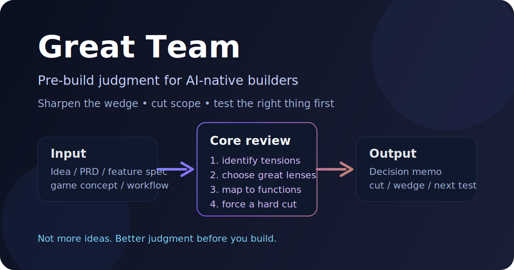
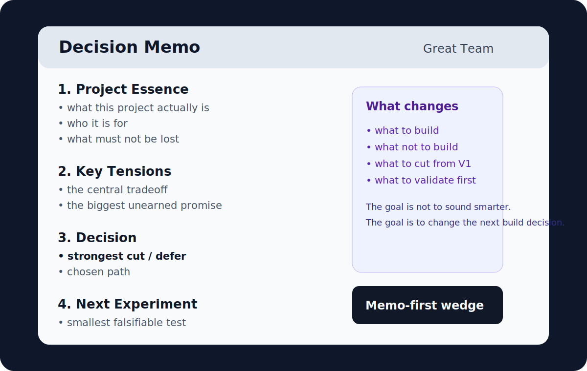

# Great Team

[](https://github.com/Feianxc/great-team/releases)
[](./LICENSE)
[](https://github.com/Feianxc/great-team)

**中文** | [English](./README_EN.md)

**Great Team** 是一个开工前的项目判断 Skill。  
它给的不是更多建议，而是更硬的判断：**这个项目真正要做什么、第一版该砍什么、最该先验证什么。**



## 它解决的核心问题

今天真正昂贵的，已经不是：

- 写代码
- 做原型
- 生成页面
- 搭工作流

真正昂贵的是这些判断：

- 这个想法到底在做什么
- 第一版真正的 wedge 是什么
- 哪些内容现在不该做
- 哪个风险最先会把项目拖偏
- 下一步最值得验证的实验是什么

很多人现在的真实困境不是“做不出来”，而是：

> **太容易做出来，所以更容易做错版本。**

## 你什么时候需要它

如果你已经有执行力，但经常遇到这些情况，`Great Team` 就是给你的：

- 想法很有吸引力，但第一版边界越来越大
- PRD 看起来完整，却没有真正锋利的切口
- 很多建议都“有道理”，但没有哪个在逼你做决定
- 你最缺的不是灵感，而是明确该砍什么
- 你不想再花几周做一个方向不够准的版本

## 它会直接给你什么

输入一个产品想法、PRD、功能草案、游戏概念、agent workflow 或策略草案，`Great Team` 会输出一份结构化 **decision memo**：

1. 项目本质
2. 关键张力
3. 推荐视角组合
4. 视角到职能的映射
5. 最强反对意见
6. 决策建议
7. 下一步最小可证伪实验
8. 边界与未验证项

重点不在“说得更聪明”，而在：

> **改变你接下来要做什么。**

## 它和普通 AI 点评有什么区别

| 普通点评 | Great Team |
|---|---|
| 给你更多建议 | 逼你做更少、更硬的决定 |
| 容易继续展开 | 优先帮你收口 |
| 常常泛化 | 强行找出这个项目独有的张力 |
| 常说“可以试试” | 更常说“先不要做这个” |
| 容易停在观点层 | 会落到 hard cut 和 next experiment |

## 核心方法

`Great Team` 的方法很简单：

1. 找出项目最关键的矛盾
2. 选出最合适的“伟大视角”
3. 把这些视角映射到真正需要判断的职能区
4. 输出一份 decision-dense 的 memo

这里的“伟大视角”不是角色扮演，而是判断框架，比如：

- Philosopher
- Writer
- Scientist
- Editor-Critic
- Social Psychologist
- Poet
- Artist

## 一个最小例子

很多 idea 的常见问题不是“没有亮点”，而是**第一版野心太大**。  
`Great Team` 会先逼出这种判断：

> 不要先做完整系统，先做一个更可信的 wedge。  
> 不要先做平台，先做一个能改变真实决策的最小工作流。

下面这张图展示的是它最终产物的形态：



## 适合谁

- AI-native solo builder
- 小团队创始人
- 产品型工程师
- founder-designer
- 创意技术人

这些人的共同点通常只有一个：

> **执行能力已经够强，真正稀缺的是判断。**

## 它不是什么

`Great Team` 不是：

- 名人模仿器
- 多 agent 开会表演
- 通用 agent 平台
- 虚拟公司模拟器
- 帮你把项目直接做完的执行工具

它只做一件事：

> **在你开始做之前，帮你做更好的判断。**

## 快速开始

如果你在 Codex 中打开这个仓库，`.codex/config.toml` 已经把技能路径配置为相对路径，可以直接调用【`./great-team`】。

最直接的用法：

```text
Use $great-team to review this idea before we build:
what is the real wedge,
what should we cut,
and what should we test first?
```

也可以直接中文：

- 帮我用 great-team 审一下这个产品方向
- 这个 PRD 第一版到底该砍什么
- 这个想法真正的 wedge 是什么
- 这个项目现在最应该先验证什么

## 仓库结构

```text
.
├── .codex/
│   ├── agents/                 # 可选 reviewer / composer 配置
│   └── config.toml             # 已配置为相对路径
├── docs/assets/                # README 示例图
├── great-team/
│   ├── SKILL.md                # Skill 主体
│   ├── agents/openai.yaml      # UI 元数据
│   ├── assets/                 # 决策备忘录模板
│   ├── references/             # 协议、lens schema、验证方法等
│   ├── evals/                  # mini eval 批次结果
│   └── product/                # Great Team 产品 PRD
└── README.md
```

## 当前验证进度

这个仓库已经完成一轮内部 mini eval，对 5 个不同 brief 进行了 `great-team` 与普通 baseline critique 的对比。  
目前最稳定的结论不是“它更会说”，而是：

- 更快抓到真正的张力
- 更敢做 hard cut
- 更能缩小 next experiment
- 更容易阻止浪费时间去做错误版本

可直接查看：

- [Great Team Product PRD V1](./great-team/product/great-team-product-prd-v1.md)
- [Mini Eval Batch 01](./great-team/evals/mini-eval-batch-01.md)

## Roadmap

当前阶段的目标不是把系统做大，而是先把价值做硬：

- **V0.1**：Skill + decision memo + 内部验证
- **V0.2**：blind scoring + 更多真实 brief
- **V0.3**：更轻的产品壳子
- **未来**：`USER_*` 验证面板、memo history、更稳的 runtime

## License

MIT
