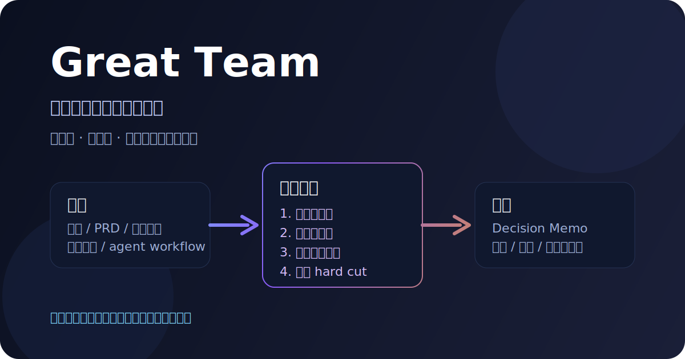
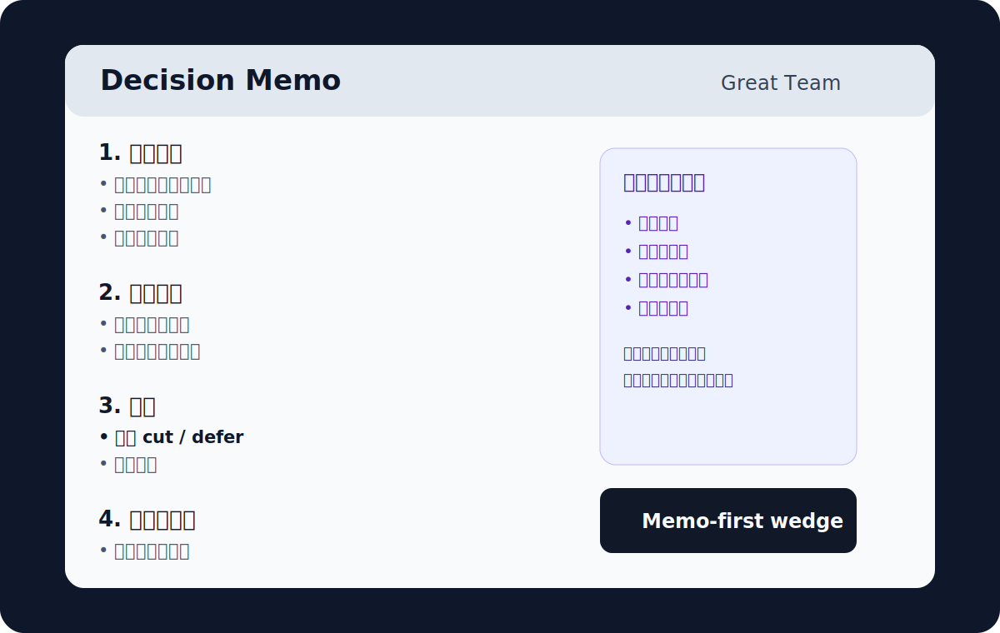

# Great Team

[](https://github.com/Feianxc/great-team/releases)
[](./LICENSE)
[](https://github.com/Feianxc/great-team)

**中文** | [English](./README_EN.md)

**Great Team 把不同领域的高水平判断力带到同一个项目里。**

诗人、哲学家、科学家、数学家、艺术家、批评家、科幻小说家，会从各自的训练出发，一起打磨同一个方向。  
对于独立创造者，这意味着在开工前真正拥有一支伟大团队。

你给它一个想法、PRD、功能草案、游戏概念或 agent workflow，它会把这些视角压到同一个项目上，帮你看清：

- 这个项目真正要做什么
- 第一版的切口在哪里
- 哪些内容现在就该砍
- 最该先验证什么



## 为什么叫「伟大团队」

### 伟大

这里说的“伟大”，是更高质量的判断：

- 看到普通建议看不到的张力
- 问出普通评审不会追问的问题
- 对范围、标准、气质和方向更挑剔
- 不满足于“能做”，还要追问“值不值得做、该怎么做得更对”

### 团队

这里说的“团队”，是多种高水平判断力同时进入同一个项目。  
它们彼此拉扯、彼此制衡、彼此抬高标准。

一个视角容易偏。  
哲学会拉高意义标准，写作会拉高清晰度，科学会拉高可验证性，批评会逼你删掉没赚到的东西，社会心理会提醒你用户会怎样理解、抗拒、误读。

`Great Team` 的价值，就在于把这种团队级判断密度压缩成一个可以直接调用的 Skill。

这里最重要的一点是：  
**这些视角不是固定分工。**  
不是“诗人只管气质”“科学家只管验证”“数学家只管规则”。  
真正的伟大团队，会让不同领域的人跨边界地看同一件事。

### 一个具体例子

比如你在做一个游戏，或者在做一个产品的第一版。  
你不一定最缺一个“前端工程师 agent”或者“产品经理 agent”。  
你更可能需要的是下面这种团队：

- 一个**诗人 AGENT**，可能会盯气质、节奏、语言、界面情绪，也可能直接挑战这个产品有没有灵魂
- 一个**哲学家 AGENT**，可能会追问它为什么值得存在，也可能直接质疑你的功能取舍和价值排序
- 一个**科学家 AGENT**，可能会设计验证实验，也可能会反过来要求你把模糊概念定义得更精确
- 一个**数学家 AGENT**，可能会盯系统结构、规则、一致性，也可能会指出你的交互和信息组织并不成立
- 一个**科幻小说家 AGENT**，可能会帮你看未来感、世界观、叙事想象，也可能直接指出你的产品想象力太保守
- 一个**艺术家 AGENT**，可能会盯形式、张力、识别度，也可能会挑战你整个产品有没有真正的表达
- 一个**批评家 AGENT**，专门负责砍掉没赚到的内容，防止第一版膨胀

关键不是谁只负责哪一块。  
关键是：**这些不同领域的人，都在用自己的判断压同一个项目。**

这样出来的结果，才不是单线条的“专业意见”，而是一种更接近真实伟大团队的东西：  
不同背景、不同训练、不同职业的人，同时参与同一件事，让这件事变得更丰富、更挑剔、更有效。

## 这个 Skill 的卖点

### 1. 给一个人一支真正像样的项目团队

普通人很难真的组到这样一支团队。  
`Great Team` 提供的是一种很稀缺的资源：**跨学科、高标准、彼此制衡的判断力**。

### 2. 帮项目找到更锋利的第一版

很多项目死得不难看。  
它们的问题通常是：第一版做得太宽、太软、太平均。  
`Great Team` 的强项就是把一个模糊方向压成一个更清楚的 wedge。

### 3. 帮你更早砍掉错误版本

它最值钱的地方，经常不在“加了什么想法”，而在**提前砍掉什么**。

### 4. 让判断先于执行

今天做东西很快。  
越是这样，越需要在开工前先把判断做硬。

## 它解决的核心问题

今天真正昂贵的，已经不是：

- 写代码
- 做原型
- 生成页面
- 搭工作流

真正昂贵的是这些判断：

- 这个想法到底在做什么
- 第一版真正的 wedge 是什么
- 哪些内容现在不该做
- 哪个风险最先会把项目拖偏
- 下一步最值得验证的实验是什么

很多人现在真正卡住的地方是：

> **太容易做出来，所以更容易做错版本。**

## 你什么时候需要它

如果你已经有执行力，但经常遇到这些情况，`Great Team` 就是给你的：

- 想法很有吸引力，但第一版边界越来越大
- PRD 看起来完整，却没有真正锋利的切口
- 很多建议都“有道理”，但没有哪个在逼你做决定
- 你最缺的不是灵感，而是明确该砍什么
- 你不想再花几周做一个方向不够准的版本

## 它会直接给你什么

输入一个产品想法、PRD、功能草案、游戏概念、agent workflow 或策略草案，`Great Team` 会输出一份结构化 **decision memo**：

1. 项目本质
2. 关键张力
3. 推荐视角组合
4. 视角到职能的映射
5. 最强反对意见
6. 决策建议
7. 下一步最小可证伪实验
8. 边界与未验证项

重点在于：

> **改变你接下来要做什么。**

## 它和普通 AI 点评的差别

| 普通点评 | Great Team |
|---|---|
| 给你更多建议 | 逼你做更少、更硬的决定 |
| 容易继续展开 | 优先帮你收口 |
| 常常泛化 | 强行找出这个项目独有的张力 |
| 常说“可以试试” | 更常说“先不要做这个” |
| 容易停在观点层 | 会落到 hard cut 和 next experiment |

## 核心方法

`Great Team` 的方法很简单：

1. 找出项目最关键的矛盾
2. 选出最合适的“伟大视角”
3. 把这些视角映射到真正需要判断的职能区
4. 输出一份 decision-dense 的 memo

这里的“伟大视角”是判断框架，比如：

- Philosopher
- Writer
- Scientist
- Editor-Critic
- Social Psychologist
- Poet
- Artist

它们不是固定绑在某一个职能上的。  
同一个视角可以跨界看项目的不同层面；同一个问题，也值得被多个视角同时盯住。

## 一个最小例子

很多 idea 的常见问题不是“没有亮点”，而是**第一版野心太大**。  
`Great Team` 会先逼出这种判断：

> 不要先做完整系统，先做一个更可信的 wedge。  
> 不要先做平台，先做一个能改变真实决策的最小工作流。

下面这张图展示的是它最终产物的形态：



## 适合谁

- AI-native solo builder
- 小团队创始人
- 产品型工程师
- founder-designer
- 创意技术人

这些人的共同点通常只有一个：

> **执行能力已经够强，真正稀缺的是判断。**

## 这套东西不会替你解决什么

它不会替你完成开发，不会替你做用户研究，也不会靠热闹的多 agent 对话来制造价值。  
它的作用很集中：**在开工前，把项目判断做得更准、更硬、更收敛。**

## 快速开始

如果你在 Codex 中打开这个仓库，`.codex/config.toml` 已经把技能路径配置为相对路径，可以直接调用【`./great-team`】。

最直接的用法：

```text
Use $great-team to review this idea before we build:
what is the real wedge,
what should we cut,
and what should we test first?
```

也可以直接中文：

- 帮我用 great-team 审一下这个产品方向
- 这个 PRD 第一版到底该砍什么
- 这个想法真正的 wedge 是什么
- 这个项目现在最应该先验证什么

## 仓库结构

```text
.
├── .codex/
│   ├── agents/                 # 可选 reviewer / composer 配置
│   └── config.toml             # 已配置为相对路径
├── docs/assets/                # README 示例图
├── great-team/
│   ├── SKILL.md                # Skill 主体
│   ├── agents/openai.yaml      # UI 元数据
│   ├── assets/                 # 决策备忘录模板
│   ├── references/             # 协议、lens schema、验证方法等
│   ├── evals/                  # mini eval 批次结果
│   └── product/                # Great Team 产品 PRD
└── README.md
```

## 当前验证进度

这个仓库已经完成一轮内部 mini eval，对 5 个不同 brief 进行了 `great-team` 与普通 baseline critique 的对比。  
目前最稳定的结论不是“它更会说”，而是：

- 更快抓到真正的张力
- 更敢做 hard cut
- 更能缩小 next experiment
- 更容易阻止浪费时间去做错误版本

可直接查看：

- [Great Team Product PRD V1](./great-team/product/great-team-product-prd-v1.md)
- [Mini Eval Batch 01](./great-team/evals/mini-eval-batch-01.md)

## Roadmap

当前阶段的目标不是把系统做大，而是先把价值做硬：

- **V0.1**：Skill + decision memo + 内部验证
- **V0.2**：blind scoring + 更多真实 brief
- **V0.3**：更轻的产品壳子
- **未来**：`USER_*` 验证面板、memo history、更稳的 runtime

## License

MIT
